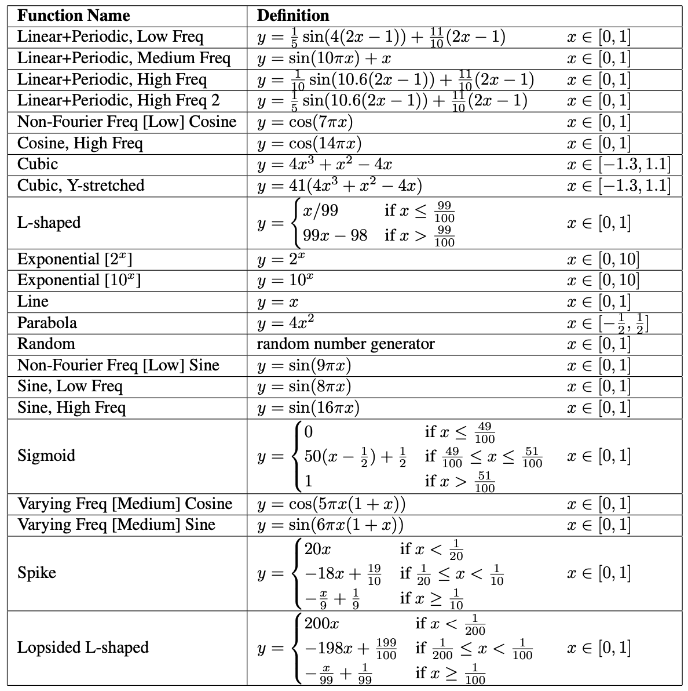
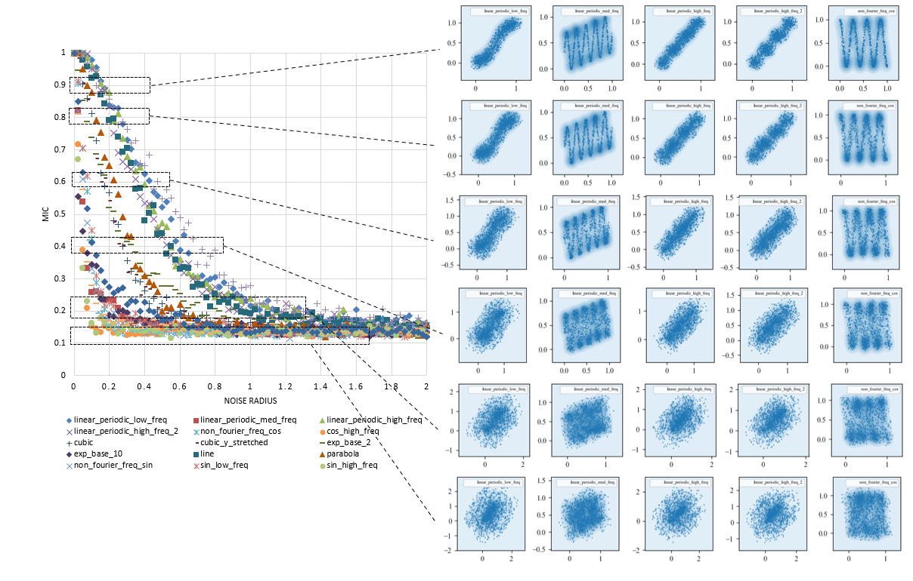
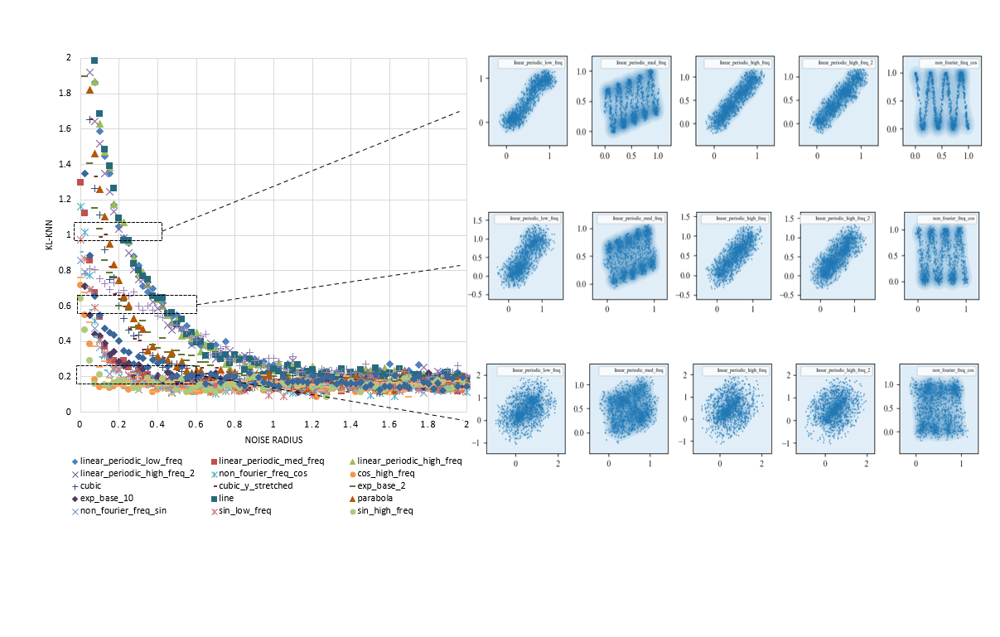

# Data-Information-Measure

#### 介绍

数据信息测量

#### 工作计划

- [x] 数据集构建
  - [x] 完成基于Reshef MIC文章数据集构建代码  
- [ ] 方法代码编写
  - [ ] KNN类方法
    - [x] classical KNN estimator[^2][^3][^4][^5][^6]
    - [ ] KPN estimator[^2]
  - [ ] 分箱类方法
    - [x] MIC方法[^1]
    - [ ] RMIC方法
    - [ ] 经典的MI方法
- [ ] 方法测试
  - [x] MIC的测试
    - 基本还是能够反映MIC值与不同变量分布不确定度之间的一致性关系  
    - **TODO**: 现有测试效果与文献报道有差别, 并没有获得良好的可视化图像
  - [x] KL-KNN测试
  - [ ] KPN测试
  - [ ] 经典分箱MI方法的测试

#### 软件架构

##### 1. 数据集生成

数据集按照以下规则生成[^1]：

代码位于core.dataset.data_generator中。

##### 2. 基于分箱的互信息方法

1. MIC方法  
   - 代码位置：core.entropy.binning_based.mic

##### 3. 基于KNN的互信息方法

1. KL-Estimator  
   - 代码位置：core.entropy.knn_based.classical

#### 性能测试

##### 1. 各算法Novelty测试

对各算法的Novelty进行测试，代码位置：src.novelty_test.novelty_test，图片保存于img/novelty_test目录下。

各方法Novelty测试结果如下
**MIC测试结果**：

**KL-KNN测试结果**：

测试结果表明：
- MIC算法对于所有线性和非线性的测试函数，满足当数据严格无噪声时，MIC值为1, 有噪音时，值趋近于一与样本量相关的固定背景值。这一性质其他基于KNN和分箱的MI算法无法满足，而且对于工业建模应用意义很大，提供了一个对于不同数据和函数关系关联强度的衡量基准；
- 当样本量较小时，MIC也能取得较为准确的结果；
- 基于KNN的MI算法计算销量更高，但是Novelty表现上不如MIC；

[^1]: D. N. Reshef, Y.A. Reshef, et al.: Supporting Online Material for Detecting Novel Associations in Large Data Sets (Table S3), Science, 2012.
[^2]: D. Lombardi, S. Pant: A Non-Parametric K-Nearest Neighbor Entropy Estimator, Physical Review E., 2016.
[^3]: L. F. Kozachenko, N. N. Leonenko: Sample estimate of entropy of a random vector. Probl. Inf. Transm., 1987.
[^4]: D. Evans: A computationally efficient estimator for mutual information, Proc. R. Soc., 2008.
[^5]: A. Kraskov, H. Stogbauer, P. Grassberger: Estimating mutual information, Phys Rev E., 2004.
[^6]: F. Perez-Cruz: Estimation of Information Theoretic Measures for Continuous Random Variables, NIPS, 2008.
