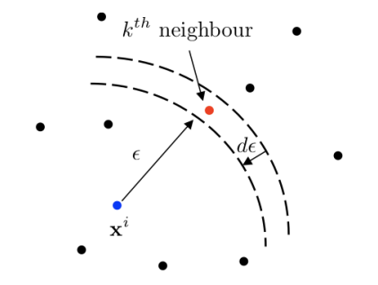

#! https://zhuanlan.zhihu.com/p/446296101

## **信息熵数值计算**

---

### **一、相关定义**  

#### **1.1 信息熵**  

离散随机变量：

$$
H(X) = -\sum_{x_{i} \in \mathcal{X}} P(x_i) \log P(x_i) \tag{1}
$$

连续随机变量：

$$
H(X) = -\int_{\mathcal{X}} p(x_i) \log p(x_i) d x_i \tag{2}
$$

#### **1.2 互信息**  

两个变量之间的互信息:

$$
\begin{align*}
I(X;Y) &= H(X) + H(Y) - H(X,Y) \\ \tag{3}
    &= H(X) - H(X|Y) \\
    &= H(Y) - H(Y|X) \\
\end{align*}
$$

两个变量关于第三个变量的条件互信息:

$$
\begin{align*}
I(X;Y|Z) &= I(X;Y,Z) - I(X;Z) \\ \tag{4}
\end{align*}
$$

特别地，当$Z$为离散变量时, 

$$
I(X;Y|Z) = \sum_{z_i \in \mathcal{Z}} I(X;Y|Z=z_i) \tag{5}
$$

#### **1.3 小结**  

对离散变量和连续变量信息熵进行计算的方式是不同的. 其中, 离散变量的信息熵计算方式固定, 直接使用式(1)即可; 而对于连续变量的信息熵, 一般通过两种途径进行计算:  

* 第一种最为简单和常见的方式就是将$X$的数据进行分箱和离散化, 然后将$X$视作离散变量计算其信息熵, 但是这种处理方式
  易受数据分箱方式的影响, 离散化处理也会带来$X$数据的信息损失, 导致信息熵值计算的误差; 
* 第二种方式便是由Kraskov等人[^1] [^2] [^3] [^4]提出的基于K近邻思想的算法, 相比于第一种基于数据分箱的方式, 基于
  KNN的方法参数更少, 受数据样本量的影响也更小(反正文献是这么报道的, 我还在做测试, 后面放出测试效果).

下一节将从以上两种对连续数据信息熵计算的方式出发进行讨论.

---

### **二、连续变量的信息熵计算**  

如果连续随机变量$X$服从概率分布$p(X)$, 我们从种获得了$N$个**独立同分布**的样本$\hat{X}=\{x_1,x_2,...,x_N\}$ (**TODO:这里需要针对时间序列是否需要满足i.i.d.条件进行讨论, 平稳性&遍历性**). 我们希望通过$\hat{X}$获得$X$在式(2)中的信息熵. 注意, 式(2)可表示为$-\log(X)$的期望, 即:

$$H(X) = {\mathbb E}(-\log(X)) = \int_{\mathcal{X}}{-\log p(x_i) \cdot p(x_i) d x_i} \tag{6} $$

采用Monte-Carlo方法对上式进行逼近有:

$$\hat H(X) = \frac{1}{N} \sum_{i=1}^N -\log p(x_i) \tag{7} $$

其中$\hat H(X)$为通过有限观测样本对$H(X)$的近似. **这样一来, 问题的关键转化为如何对式(7)中每个样本所处的概率分布密度$p(x_i)$进行准确的估计**. 

设概率密度的估计值为$\hat p(x_i)$. 从几何上来理解:

$$
\begin{align*}
\hat p(x_i) &= \frac{\hat P(\|x - x_i\| \leq \varepsilon)}{V(\|x - x_i\| \leq \varepsilon)} \\ \tag{8}
  &= \frac{N(x_i, \varepsilon)}{N \cdot V(\|x - x_i\| \leq \varepsilon)}  
\end{align*}
$$

其中$N(x_i, \varepsilon)$表示样本落入$(\|x - x_i\| \leq \varepsilon)$"球"内的样本数, $N$为总样本数, $V(\|x - x_i\| \leq \varepsilon)$为"球"对应的体积. 

人们提出了空间分箱离散化和K近邻两种手段对其进行计算. 这两种方式类似流体力学中的欧拉法和拉格朗日法, 一个侧重空间, 另一个则侧重点. 基于空间分箱离散的算法寻求对样本空间进行合理划分, 使用各子空间内样本分布频率和对应的子空间体积获得对应的平均概率密度值, 从而获得$\hat H(X)$; 而基于K近邻的算法则针对每个样本点$x_i$, 根据其离k近邻点的距离$\varepsilon$构建一个球$B(\varepsilon,x_i)$, 计算利用式(8)的原理获得样本$x_i$上的概率密度估计$\hat p(x_i)$, 最终得到式(7)中的期望$\hat H(X)$.  

#### **2.1 基于空间离散化的算法**   

Darbellay等人[^5]提出了Marginal Equiquantization分箱对数据进行离散化, 然后计算信息熵或互信息. 按照其思想, 对于一维变量的分箱原理是, 在每一次分裂时都将对应的区间$C_k$样本等分为两份$C_{k+1}^l, C_{k+1}^r$, 这样一来两个子区间$C_{k+1}^l, C_{k+1}^r$内的样本数$N_{k+1}^l=N_{k+1}^r=N_{k}/2$, 但是区间大小不等, 即$L_{k+1}^l \neq L_{k+1}^r$. 接下来, 通过样本数对子区间的概率密度进行估计:

$$
\hat p(C_{k+1}^l) = \frac{N_{k+1}^l}{N \cdot L_{k+1}^l},\quad \hat p(C_{k+1}^r) = \frac{N_{k+1}^r}{N \cdot L_{k+1}^r} \tag{9}
$$
  
如果$\hat p(C_{k+1}^l) \approx \hat p(C_{k})$或$\hat p(C_{k+1}^r) \approx \hat p(C_{k})$, 则表明$C_{k+1}^l$或$C_{k+1}^r$区间上的概率密度收敛, 此时$\hat p(C_{k+1}^l)$或$\hat p(C_{k+1}^r)$应接近该区间内$X$的真正分布$p(x), x\in C_k$
, 则可将$\hat p$用于对$\hat H(X)$的计算:

$$
\hat H(X) = \frac{1}{N} \sum_{k=1}^{N_k} -\log\hat p(C_k) \tag{10}
$$

如果$\hat p(C_{k+1}^l)$或$\hat p(C_{k+1}^r)$均不满足收敛条件, 则对其进一步进行分裂, 直至收敛为止. 最后将所有离散区间样本结果带入式(9), 获得$X$的信息熵估计值$\hat H(X)$.
  
  
#### **2.2 基于K近邻的算法**  

---

对于$d$维空间内某样本点$x_i$, 设其到第k近邻点的距离为$\varepsilon$. 则通过样本频率估计"球"$B(\varepsilon, x_i)$内的样本概率为:

$$\hat P(\|x-x_i\| < \varepsilon) = \frac{k}{N-1} \tag{11}$$

对应球的体积为:

$$V_{x_i, \varepsilon} = \frac{\pi^{d/2}\varepsilon^d}{\Gamma(d/2+1)} \tag{12}$$

将式(11)和(12)代入式(7), 有如下的**朴素K近邻熵估计器(Naive KNN Entropy Estimator)**:

$$
\begin{align*}
\hat H_{naive}(X) &= \frac{1}{N} \sum_{i=1}^N \left(-\log \frac{k\cdot\Gamma(d/2+1)}{N \pi^{d/2}\varepsilon^d} \right) \\ \tag{13}
  &= \log (N-1) + \log(\pi^{d/2}) - \log k - \log (\Gamma(d/2+1)) + <\log \varepsilon^d>
\end{align*}
$$

Singh[^6]等人在式(16)基础上提出了**渐进无偏的估计器**:

$$
\begin{align*}
\hat H_{KNN}(X) &= \frac{1}{N} \sum_{i=1}^N \left(-\log \frac{k\cdot\Gamma(d/2+1)}{N \pi^{d/2}\varepsilon^d} \right) + \log k - \psi(k) \\ \tag{14}
  &= \log (N-1) + \log(\pi^{d/2}) - \psi(k) - \log (\Gamma(d/2+1)) + <\log \varepsilon^d>
\end{align*}
$$

Kraskov[^1]提出的**KSG估计器(注意使用最大范数而非L2范数进行距离度量)**:

$$
\begin{align*}
\hat H_{KSG}(X) &= \psi(N) - \psi(k) + 2 d + d <\log \varepsilon> \\ \tag{15}
\end{align*}
$$

---

### **三、代码地址**  

**基于空间离散化**    

https://github.com/Ulti-Dreisteine/data-information-measurement/blob/main/core/entropy/binning_based/marginal_equiquant.py

**基于K近邻**  

https://github.com/Ulti-Dreisteine/data-information-measurement/tree/develop/core/mi

---

### **参考文献**  

[^1]: A. Kraskov, H. Stoegbauer, P. Grassberger: Estimating Mutual Information, 2003.  
[^2]: D. Lombardi, S. Pant: A Non-Parametric K-Nearest Neighbor Entropy Estimator, 2015.  
[^3]: W. M. Lord, J. Sun, E. M. Bolt: Geometric K-Nearest Neighbor Estimation of Entropy and Mutual information, 2018.  
[^4]: B. C. Ross: Mutual Information between Discrete and Continuous Data Sets, 2014.  
[^5]: G. A. Darbellay: Predictability: An Information-Theoretic Perspective, Signal Analysis and Prediction, 1998.  
[^6]: H. Singh, N. Misra, et al.: Nearest Neighbor Estimates of Entropy, 2003.

